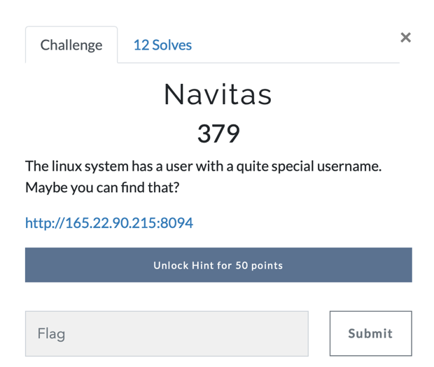
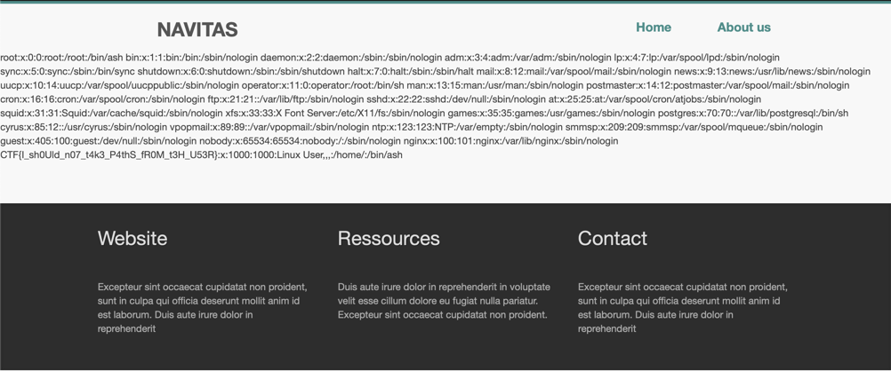

# Challenge: Navitas (Aarhus CTF 2019)
*By Team "[! leftovers](http://challenges.aarhus-ctf.dk/users/9)" (Sam Beresford & Emilie Bjerg)*
___
### Challenge description:
In this challenge we had to find the username of the linux system user. 

  

___

### Solution:
The page does not contain any input fields, and the cookies does not seem give anything away, however, there is a page-query in the url. A directory traversal attack might therefore be possible using this. Changing home.php to ../../../../../etc/passwd makes us able to view the passwd file on the webservers linux system:

  

In this the flag is found: _CTF{I_sh0Uld_n07_t4k3_P4thS_fR0M_t3H_U53R}_

Full url (http://165.22.90.215:8094/?page=../../../../../etc/passwd)
# Challenge solved!
